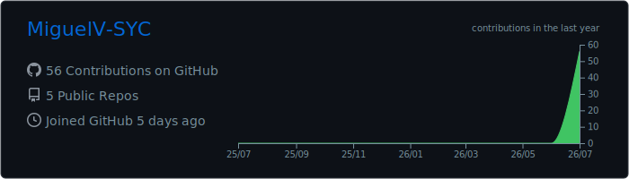
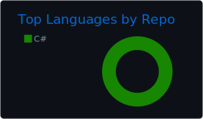
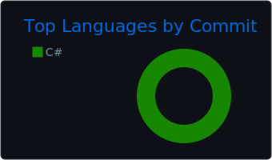

# 👋 Hola, soy Miguel Angel Villamizar Ardila

## 💻 Sobre mí

Soy Ingeniero Industrial y estudiante de último semestre de Ingeniería de Sistemas en la Universidad Cooperativa de Colombia.

Actualmente realizo mis prácticas profesionales en **Sistemas y Computadores S.A. (SYC)**, donde participo en proyectos de desarrollo backend, automatización de procesos, integración de IA y buenas prácticas de desarrollo de software.

---

## 🚀 Tecnologías

---

## 📊 Estadísticas

---

## 🔥 Racha

---

## 📈 Actividad

---

## 📋 GitHub Summary

---

## 📊 Metrics

---

## 🐍 Contribuciones

---

## 📫 Contacto

📧 m.villamizar@syc.com.co
